# WAPH-Web Application Programming and Hacking

## Instructor: Dr. Phu Phung

## Student

**Name**: Naga Swetha Vempati

**Email**: vempatna@mail.uc.edu

**Short-bio**: An enthusiastic application developer willing to learn trending technologies. 

## Individual Project -1 : Front-end Web Development - Overview

Respository's URL: [https://github.com/vempatna/vempatna.github.io](https://github.com/vempatna/vempatna.github.io)

This project involves developing a professional webpage that includes my name, headshot, contact information, education, and a downloadable resume in PDF format. Open-source CSS or Bootstrap templates are used to create a visually appealing and responsive design. Toggling email visibility, real-time clocks, and integrating two or more online APIs with JavaScript and jQuery are some of the functional elements on the homepage. A link leads to the WAPH course summary. The website uses jQuery to create a mouse hover effect and highlight parts in different colors. The skills section differentiates skill types using toggle buttons and React framework integration. Cookies remember customers and generate an alert message with a welcome greeting, last login time, and visit count for customisation. A page tracker records unique visits, providing information about the portfolio's popularity. The project code is hosted on GitHub Pages, providing simple access to my professional profile.

Professional Profile Webpage Url: [https://vempatna.github.io/Individual_Project-1/Orbit-BS5-v3.0/index.html](https://vempatna.github.io/Individual_Project-1/Orbit-BS5-v3.0/index.html)

### General Requrirements

## Task -1 
Included my name, headshot and contact details in my porfile section. Also I have added my carrer objective, work experiences, skills, certifications and the porjects that I have done in seperate sections. Along with that I have also added a hypeelink that will direct to the pdf format of my professional resume. All the files of this individual project has been deployed to github cloud and accessible anywhere via my link.

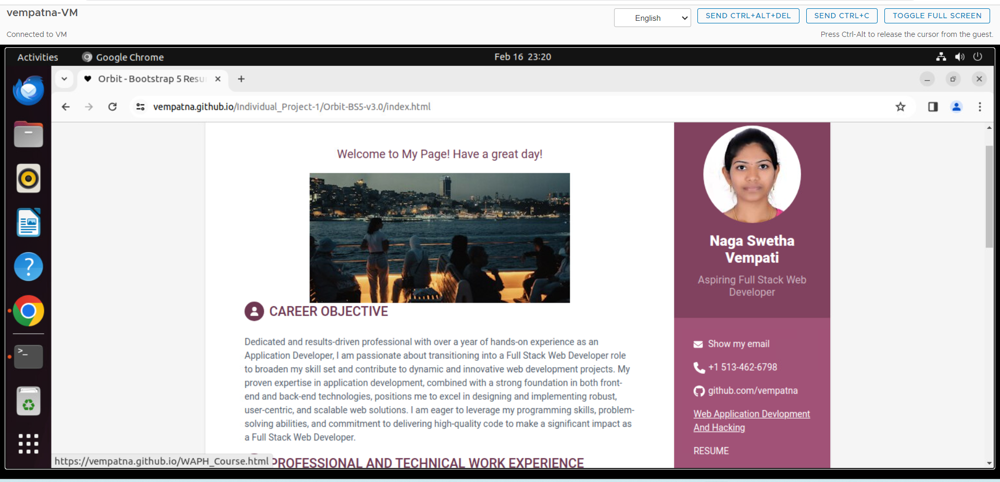

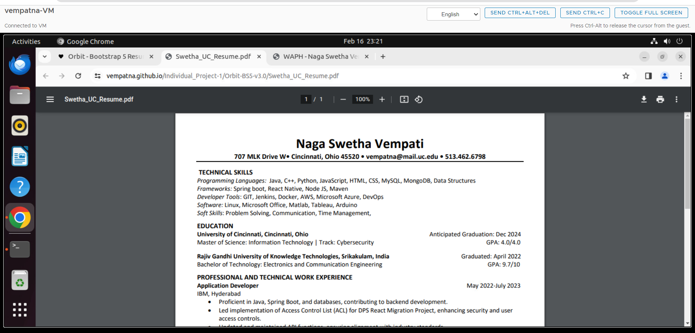

## Task -2
I have included a hyperlink "Web Application Development and Hacking" which will take you to another webpage that contains all the details of the course and the work that I have done in this course.

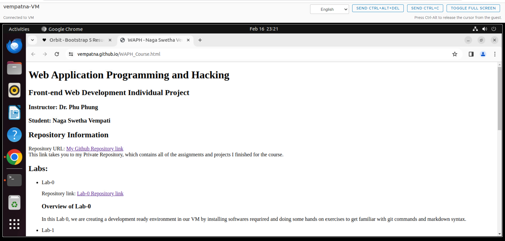

## Non Technical Requirements

## Task - 1
I have used an open source Orbit theme bootstrap template for styling my webpage. Along with that template I have added inline css styling accordingly to make my webpage looks more interactive and lively.

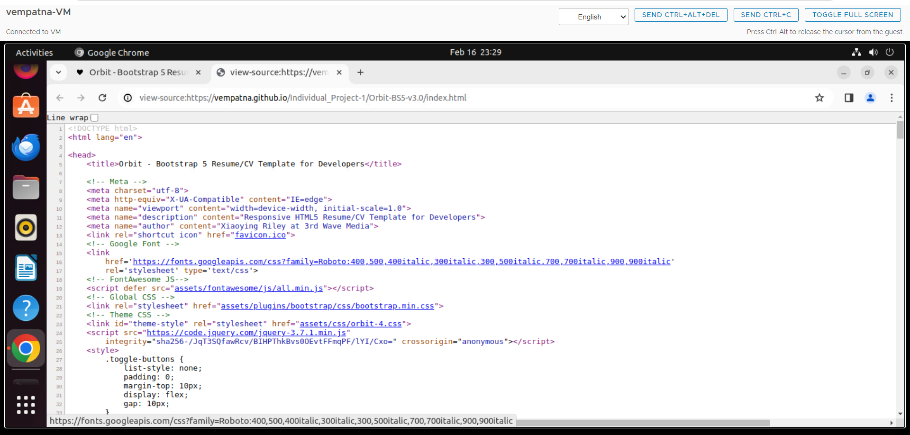

## Task - 2

I have added page tracker by using the html code provided the flag counter website. This page tracker will track the unique visits of our webpage and keeps track of that count. I made it displayed in the footer section of my webpage

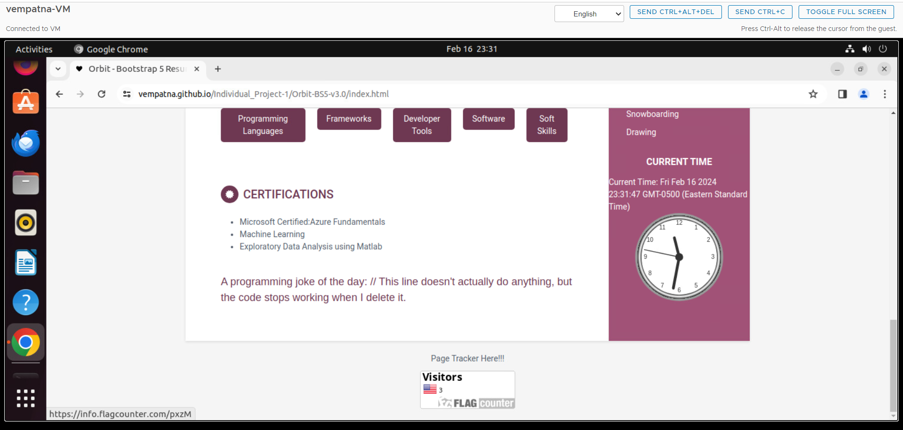

## Technical Requirements

### Task - 1 : Adding Javascript code from Lab-2 along with the usage of JQuery and React Framework

I have included all the three functionalities like show or hide email, digital clock along with the analog clock that enables users to view current time from Lab-2.

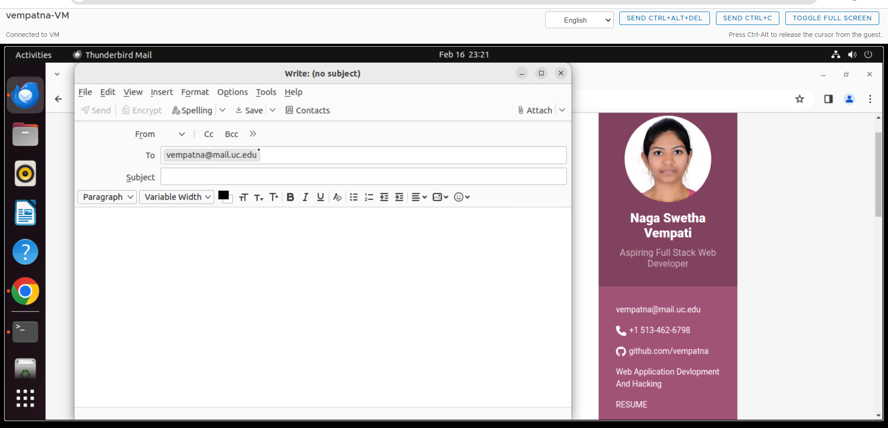

Along with that I have added a functionality to highlight a particular to light blue backgraoung instead of white upon mouse hovering. This is achieved by integrating jQuery with javascript.

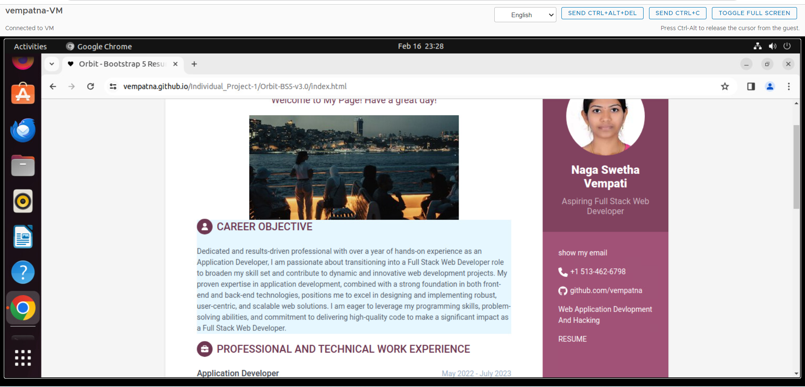

To improve the interactivity of my website, I included a function that allows users to toggle between talents based on their type, such as programming languages, developer tools, soft skills, etc. This feature is achieved by toggle buttons that, when clicked, display the appropriate skills. The application makes advantage of the React framework's state and props functions to provide a seamless and dynamic user experience.

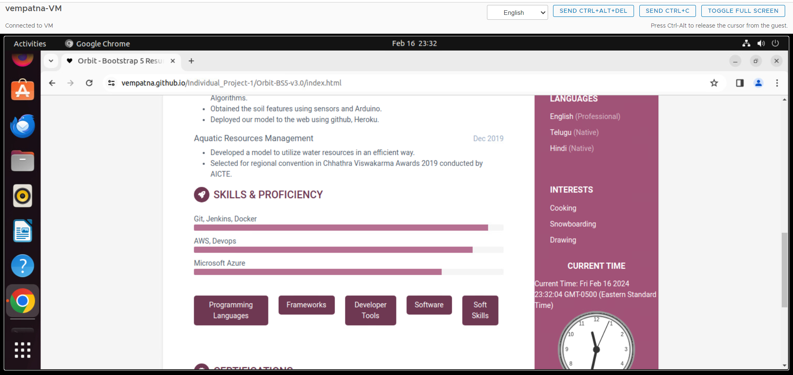

### Task - 2 : Web Api Integrations
Similar to what was done in lab-2, I've integrated a jokes website into the webpage, which displays a randomly chosen joke. However, rather than presenting a new joke with each page reload, I've added functionality to fetch and display a new joke every minute using the fetch method.

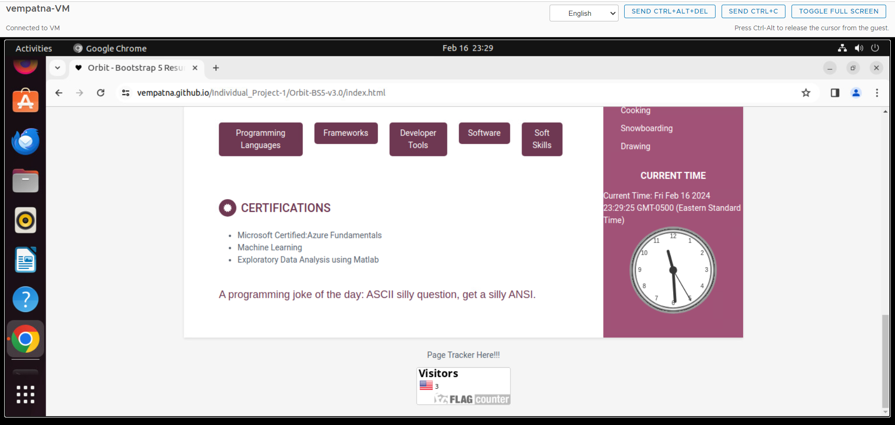

For another web api integration, I have choosed a graphic integration rather than a text api integration. In this we have written to functionality to display a random image whenever a webpage is reloaded along with a greeting message.

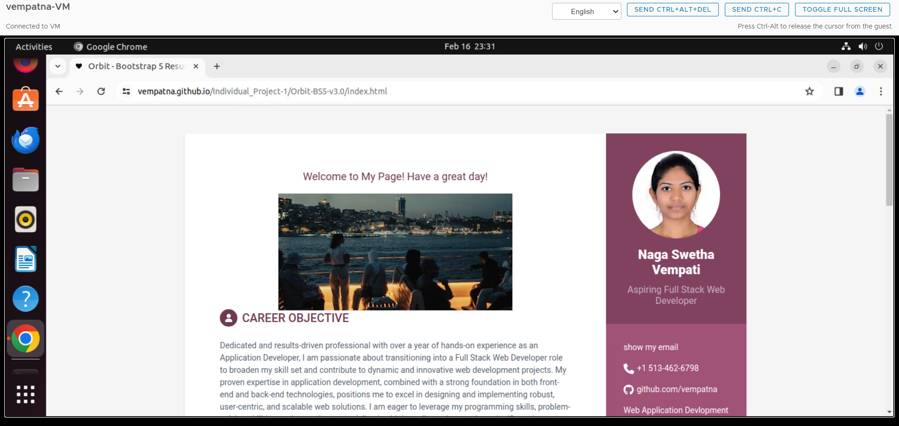

### Task - 3 : Cookies
Cookies have been incorporated into our website to remember the client. For the initial visit, an alert is triggered, displaying a welcome message. Subsequent visits prompt an alert with a "Welcome back to my page" message, showcasing the last login time and the total number of visits

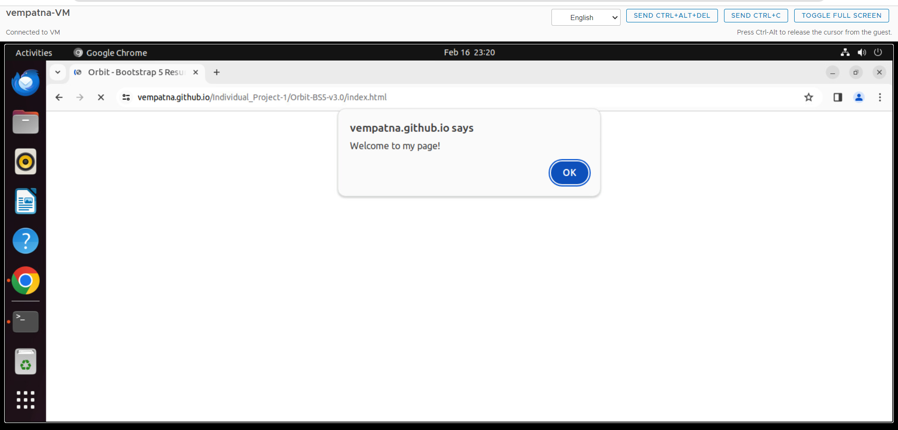

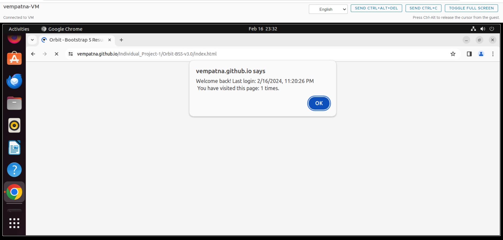

